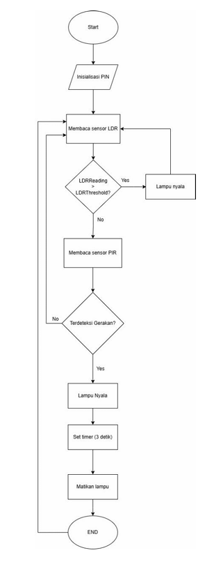

# Automatic Light Controller with PIR and LDR Sensors
This repository contains the implementation and documentation of a project using an Arduino Uno R3 microcontroller to control lights automatically based on motion detection (PIR sensor) and ambient light intensity (LDR sensor).

## Overview
The project utilizes the Arduino Uno R3, a popular microcontroller platform, to achieve the following functionalities:

Automatic light activation based on motion detection using a PIR sensor.
Adjusting light operation according to ambient brightness using an LDR sensor.
Real-time sensor data processing for efficient light control.
Objectives
Implement a real-time automatic light control system using Arduino Uno R3.
Integrate PIR and LDR sensors for motion detection and light intensity measurement.
Demonstrate GPIO-based sensor and LED control.

## Hardware Requirements
 - Arduino Uno R3
 - Breadboard
 - LED
 - Resistor (220 ohm)
 - Jumper wires
 - Button or switch
 - PIR sensor
 - LDR sensor

## Software Tools
 - Arduino IDE (for code development and uploading)

## Flowchart

## How to Use
- Set up the hardware connections as per the schematic.

- Upload the provided firmware onto the Arduino Uno using the Arduino IDE.

- Power the system and observe the automatic light control in action.

## Contributors
Sahrul Ridho Firdaus

Vinsensius Jonathan Fajarai

Dewo Antonioly

Ferensia Fransisca Agatha

Grace Agustina Hutagalung

> The report is only available in Bahasa Indonesia
